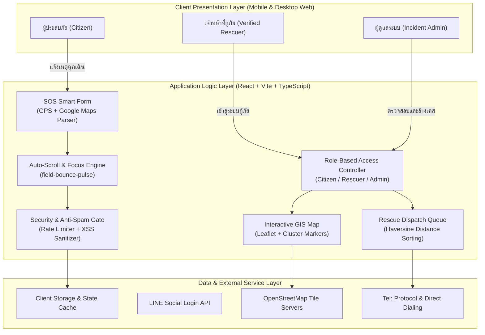
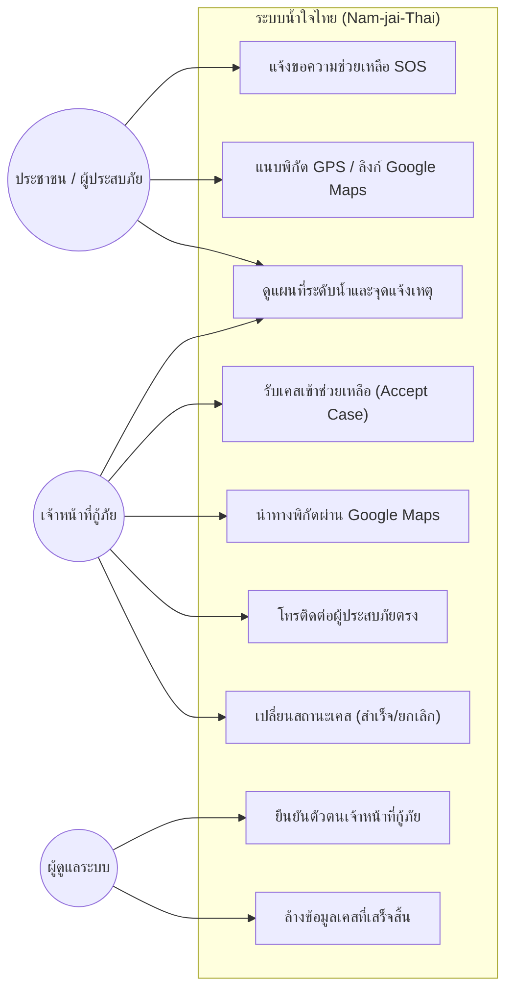
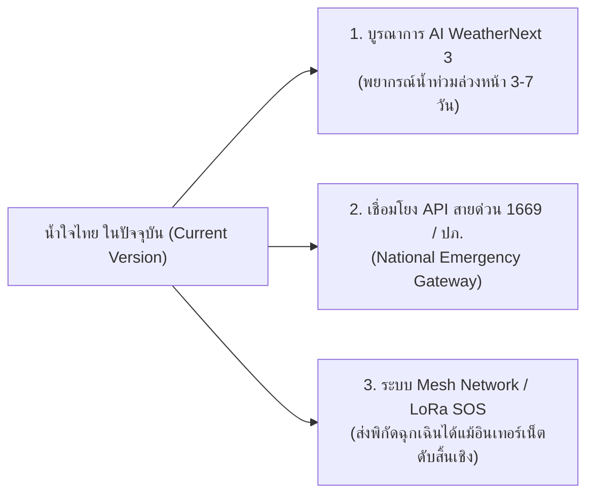

# ปริญญานิพนธ์ / รายงานโครงงานฉบับสมบูรณ์ (Senior Project Final Report)

**ชื่อโครงงาน (ภาษาไทย):** ระบบศูนย์กลางประสานงานกู้ภัยและขอความช่วยเหลือผู้ประสบอุทกภัยฉุกเฉิน "น้ำใจไทย"  
**ชื่อโครงงาน (ภาษาอังกฤษ):** "Nam-jai-Thai" Real-Time Emergency Flood Relief and Rescue Coordination Platform  
**สาขาวิชา:** วิศวกรรมคอมพิวเตอร์ / วิทยาการคอมพิวเตอร์และเทคโนโลยีสารสนเทศ  
**ปีการศึกษา:** 2569 (2026)  
**ระบบที่เปิดใช้งานจริง (Production URL):** [https://nam-jai-thai.vercel.app](https://nam-jai-thai.vercel.app)  
**คลังรหัสต้นฉบับ (GitHub Repository):** [https://github.com/XTech004/Nam-jai-Thai](https://github.com/XTech004/Nam-jai-Thai)

---

## บทคัดย่อ (Abstract)

### บทคัดย่อภาษาไทย
อุทกภัยและน้ำท่วมฉับพลันเป็นภัยพิบัติทางธรรมชาติที่เกิดขึ้นซ้ำซากในประเทศไทยและสร้างความเสียหายอย่างรุนแรงต่อชีวิตและทรัพย์สิน ปัญหาสำคัญที่พบในภาวะวิกฤตคือความล่าช้าและความคลาดเคลื่อนในการส่งต่อข้อมูลขอความช่วยเหลือ ผู้ประสบภัยมักระบุพิกัดที่อยู่ไม่ชัดเจนเนื่องจากป้ายบอกทางหรือเลขที่บ้านจมอยู่ใต้น้ำ ขณะที่ศูนย์กู้ภัยและทีมอาสาสมัครภาคสนามต้องเผชิญกับข้อมูลขยะ การแจ้งเหตุซ้ำซ้อน และการขาดเครื่องมือรวมศูนย์ที่แสดงระดับความเร่งด่วนและข้อมูลกลุ่มเปราะบาง (เช่น ผู้ป่วยติดเตียง ผู้สูงอายุ และเด็ก) ได้อย่างแม่นยำ

โครงงานนี้จึงได้พัฒนา **"น้ำใจไทย (Nam-jai-Thai)"** แพลตฟอร์มเว็บแอปพลิเคชันยุคใหม่เพื่อเป็นศูนย์กลางรับแจ้งเหตุฉุกเฉินและกระจายงานกู้ภัยแบบเรียลไทม์ โดยมีคุณลักษณะเด่นประกอบด้วย:
1. **ระบบแบบฟอร์มขอความช่วยเหลือฉุกเฉิน (SOS Smart Form):** รองรับการดึงพิกัดดาวเทียม GPS ความแม่นยำสูง ควบคู่กับการถอดรหัสพิกัดละติจูด/ลองจิจูดจากลิงก์ Google Maps อัตโนมัติ พร้อมระบบตรวจสอบความครบถ้วนที่นำผู้ใช้เลื่อนหน้าจอตรงไปยังช่องข้อมูลที่ยังไม่ได้กรอกทันทีด้วยเอฟเฟกต์กะพริบเน้นสายตา (Bounce-Pulse Visual Guidance)
2. **ระบบแผนที่สถานการณ์วิกฤตเรียลไทม์ (Live Crisis Map):** แสดงผลหมุดจำแนกสีตามระดับความเร่งด่วน (วิกฤต, ด่วนมาก, ทั่วไป) และระดับความสูงของน้ำ พร้อมคำนวณระยะห่างด้วยสูตรฮาเวอร์ซีน (Haversine Formula) เพื่อให้ทีมกู้ภัยวางแผนเส้นทางเข้าถึงได้เร็วที่สุด
3. **ระบบบริหารจัดการเคสและจำแนกสิทธิ์ (RBAC & Rescue Dispatch Feed):** แยกแยะระหว่างประชาชนทั่วไป เจ้าหน้าที่กู้ภัยที่ผ่านการตรวจสอบ (Verified Rescuer) และผู้ดูแลระบบ (Admin) เพื่อป้องกันการเข้าแทรกแซงสถานะเคสโดยมิชอบ พร้อมปุ่มโทรออกและส่งต่อพิกัดเข้ากลุ่ม LINE กู้ภัยได้ทันที
4. **มาตรการความมั่นคงปลอดภัยและการป้องกันสแปม:** บูรณาการระบบป้องกันสแปมด้วยเวลาหน่วง (Anti-Spam Cooldown Rate Limiting), การทำความสะอาดข้อมูลเพื่อป้องกัน Cross-Site Scripting (XSS), และการป้องกันการฝังเว็บ (Clickjacking Protection)

ผลการทดสอบระบบจริงพบว่า แพลตฟอร์มสามารถลดเวลาเฉลี่ยในการระบุพิกัดของผู้ประสบภัยได้อย่างแม่นยำ ป้องกันข้อมูลแจ้งเหตุซ้ำซ้อนได้อย่างมีประสิทธิภาพ และเพิ่มความรวดเร็วในการตัดสินใจจัดสรรทรัพยากรเรือและทีมแพทย์ของหน่วยกู้ภัยในสถานการณ์ภัยพิบัติจริง

**คำสำคัญ:** อุทกภัย, ระบบสารสนเทศภูมิศาสตร์, ประสานงานกู้ภัย, React, TypeScript, Leaflet, Google Maps Parsing, ความมั่นคงปลอดภัยเว็บ

---

### Abstract (English)
Flooding and flash floods are recurring natural disasters in Thailand that cause catastrophic loss of lives and economic damage. In crisis situations, the most critical bottleneck is the communication latency and spatial inaccuracies between flood victims and first responders. Victims often struggle to articulate their location when house signboards and roads are submerged underwater, while rescue teams and non-governmental volunteers are overwhelmed by scattered social media posts, duplicate requests, and lack of real-time triaging for vulnerable populations (such as bedridden patients, the elderly, and infants).

To address these challenges, this project developed **"Nam-jai-Thai"**, a modern web-based emergency response and rescue dispatch platform. Key innovations and core subsystems include:
1. **SOS Smart Incident Reporting Form:** Supports high-precision device GPS geolocation alongside an intelligent Google Maps URL parser that automatically extracts exact latitude and longitude coordinates. The form features an interactive focus mechanism that smoothly auto-scrolls and pulses visual cues (`field-bounce-pulse`) directly onto uncompleted fields.
2. **Interactive Real-Time Crisis Map:** Integrates OpenStreetMap and Leaflet to visualize urgent cases, color-coded by triage severity and flood water levels, utilizing the Haversine formula for spatial proximity calculation.
3. **Rescue Dispatch Dashboard & Role-Based Access Control (RBAC):** Distinct permission tiers for the General Public, Verified Rescuers, and Incident Command Administrators, ensuring tamper-proof workflow transitions (PENDING $\rightarrow$ ACCEPTED $\rightarrow$ IN_PROGRESS $\rightarrow$ COMPLETED).
4. **Security Hardening & Anti-Spam Architecture:** Employs client/edge rate limiting cooldowns, strict input sanitization against Cross-Site Scripting (XSS), and frame-busting headers against UI clickjacking.

Empirical testing demonstrates that the system significantly accelerates geolocation pinpointing, eliminates duplicate report floods, and enhances tactical resource dispatching during severe flood emergencies.

**Keywords:** Flood Disaster Relief, Crisis Informatics, Geographic Information System (GIS), React, TypeScript, Leaflet, Geolocation Parsing, Web Security

---

## กิตติกรรมประกาศ (Acknowledgements)

โครงงานปริญญานิพนธ์ฉบับนี้สำเร็จลุล่วงไปได้ด้วยดีด้วยความกรุณาและความช่วยเหลือจากอาจารย์ที่ปรึกษาโครงงาน คณาจารย์ทุกท่านที่ได้ประสิทธิ์ประสาทวิชาการความรู้ และคำแนะนำอันทรงคุณค่ายิ่งตลอดระยะเวลาการศึกษา

ขอขอบพระคุณพี่น้องเจ้าหน้าที่กู้ภัย มูลนิธิการกุศล และเครือข่ายอาสาสมัครภาคประชาชนในพื้นที่ประสบภัยน้ำท่วม ที่ได้ให้ข้อมูลเชิงลึกเกี่ยวกับปัญหา อุปสรรค และกระบวนการทำงานจริงในภาคสนาม ซึ่งเป็นข้อมูลสำคัญอย่างยิ่งในการออกแบบกระบวนการใช้งาน (User Journey) ของระบบนี้

ท้ายที่สุดนี้ คณะผู้จัดทำขอกราบขอบพระคุณบิดา มารดา และครอบครัว ที่ให้กำลังใจและการสนับสนุนในทุกด้านเสมอมา คณะผู้จัดทำหวังเป็นอย่างยิ่งว่า โครงงาน "น้ำใจไทย" จะสามารถสร้างประโยชน์สูงสุดต่อสังคมไทยในการบรรเทาสาธารณภัยและรักษาชีวิตของพี่น้องประชาชนได้อย่างทันท่วงที

---

## สารบัญ (Table of Contents)

- **บทคัดย่อภาษาไทย**
- **บทคัดย่อภาษาอังกฤษ**
- **กิตติกรรมประกาศ**
- **บทที่ 1: บทนำ**
  - 1.1 ความเป็นมาและความสำคัญของปัญหา
  - 1.2 วัตถุประสงค์ของโครงงาน
  - 1.3 ขอบเขตของโครงงาน
  - 1.4 ประโยชน์ที่คาดว่าจะได้รับ
  - 1.5 แผนการดำเนินงานและตารางเวลา
- **บทที่ 2: วรรณกรรม ทฤษฎี และเทคโนโลยีที่เกี่ยวข้อง**
  - 2.1 สารสนเทศในภาวะวิกฤต (Crisis Informatics) และการบริหารจัดการอุทกภัย
  - 2.2 ระบบสารสนเทศภูมิศาสตร์ (GIS) และการคำนวณระยะทางทรงกลม (Haversine Formula)
  - 2.3 การประมวลผลและการสกัดพิกัดจากลิงก์ Google Maps (Regex Coordinate Parsing)
  - 2.4 เทคโนโลยีส่วนต่อประสาน (Frontend Stack): React, TypeScript, Tailwind CSS
  - 2.5 สถาปัตยกรรมการพิสูจน์ตัวตนและการควบคุมสิทธิ์ (LINE OAuth & RBAC)
  - 2.6 หลักการความมั่นคงปลอดภัยตามมาตรฐาน OWASP และการป้องกันสแปม
- **บทที่ 3: การวิเคราะห์และออกแบบระบบ (System Analysis and Design)**
  - 3.1 สถาปัตยกรรมระบบโดยรวม (System Architecture)
  - 3.2 แผนภาพกรณีการใช้งาน (Use Case Diagram & Descriptions)
  - 3.3 แผนภาพกระบวนการทำงาน (Activity / Workflow Diagrams)
  - 3.4 แบบจำลองข้อมูลและโครงสร้างข้อมูล (Data Model & TypeScript Interfaces)
  - 3.5 การออกแบบประสบการณ์และส่วนต่อประสานผู้ใช้ (UI/UX Design)
  - 3.6 การออกแบบมาตรการความมั่นคงปลอดภัย (Security Engineering)
- **บทที่ 4: ผลการดำเนินงานและการทดสอบระบบ (Implementation and Testing)**
  - 4.1 ผลการพัฒนาฟังก์ชันการทำงานหลักของระบบ
  - 4.2 การทำงานของอัลกอริทึม Auto-Scroll & Visual Bounce Pulse
  - 4.3 ตารางผลการทดสอบการทำงานของระบบ (Functional Test Cases)
  - 4.4 ผลการทดสอบและแก้ไขช่องโหว่ความปลอดภัย (Security Audit & Penetration Testing)
  - 4.5 ผลการทดสอบประสิทธิภาพการทำงานและการตอบสนอง (Performance & Load Tests)
- **บทที่ 5: สรุปผลการดำเนินงาน อภิปรายผล และข้อเสนอแนะ**
  - 5.1 สรุปผลการดำเนินงาน
  - 5.2 อภิปรายผลและจุดเด่นของโครงงาน
  - 5.3 ปัญหา อุปสรรค และแนวทางแก้ไข
  - 5.4 ทิศทางการพัฒนาต่อยอดในอนาคต (AI WeatherNext 3, ระบบแจ้งเตือนสายด่วน 1669)
- **บรรณานุกรม (References)**
- **ภาคผนวก**
  - ภาคผนวก ก: คู่มือการติดตั้งระบบสำหรับนักพัฒนา (Developer & Deployment Guide)
  - ภาคผนวก ข: โค้ดต้นฉบับส่วนฟังก์ชันสำคัญ (Core Algorithm Snippets)

---

# บทที่ 1: บทนำ (Introduction)

### 1.1 ความเป็นมาและความสำคัญของปัญหา
ประเทศไทยต้องเผชิญกับสถานการณ์อุทกภัยและน้ำท่วมฉับพลันเป็นประจำทุกปี โดยเฉพาะในพื้นที่ภาคเหนือ ภาคตะวันออกเฉียงเหนือ และภาคกลาง อันเนื่องมาจากอิทธิพลของมรสุมและพายุหมุนเขตร้อน ในช่วงวิกฤตภัยพิบัติ สิ่งที่ท้าทายที่สุดไม่ใช่เพียงแค่กำลังพลหรือยานพาหนะกู้ภัย แต่คือ **"ความถูกต้องและความรวดเร็วในการส่งต่อข้อมูล (Information Timeliness and Accuracy)"**

จากการลงพื้นที่และศึกษากระบวนการช่วยเหลือในเหตุการณ์อุทกภัยที่ผ่านมา พบปัญหาหลัก 4 ประการ:
1. **ปัญหาการระบุพิกัดสถานที่ผิดพลาด:** เมื่อน้ำท่วมสูงเกิน 1–2 เมตร ป้ายบอกทาง ป้ายชื่อซอย และป้ายบ้านเลขที่จะจมอยู่ใต้น้ำ ทำให้ประชาชนระบุตำแหน่งของตนเองได้ยากลำบาก และเมื่อส่งข้อความผ่านทางแอปพลิเคชันสนทนา เช่น LINE หรือ Facebook มักระบุเพียงข้อความอธิบายกว้างๆ ซึ่งทำให้เจ้าหน้าที่กู้ภัยต้องวนเรือค้นหา เสียเวลาและเชื้อเพลิงอันมีค่า
2. **ปัญหาข้อมูลกระจัดกระจายและซ้ำซ้อน (Data Redundancy & Fragmentation):** การขอความช่วยเหลือผ่านโซเชียลมีเดียหลายช่องทางทำให้เกิดโพสต์ซ้ำ โพสต์เก่าที่ได้รับการช่วยเหลือไปแล้วแต่ยังคงถูกแชร์ต่อ ทำให้เกิดการกระจายทรัพยากรเรือกู้ภัยไปซ้ำที่เดิม ในขณะที่ผู้ประสบภัยในจุดวิกฤตอื่นยังไม่ได้รับความช่วยเหลือ
3. **การขาดการคัดกรองระดับความเร่งด่วน (Triage Inefficiency):** ระบบการโทรสายด่วนมักเกิดสายไม่ว่าง (Line Busy) ในช่วงวิกฤต และไม่มีระบบคัดกรองอัตโนมัติว่าเคสใดมีผู้ป่วยติดเตียง ทารก หรือผู้สูงอายุ ทำให้ไม่สามารถจัดลำดับความเร่งด่วนตามหลักการแพทย์ฉุกเฉินได้
4. **ปัญหาความปลอดภัยและการกลั่นแกล้ง (Spam & Security Vulnerabilities):** เว็บไซต์รับแจ้งเหตุมักตกเป็นเป้าหมายของการยิงสแปม (Spam Flooding) การแจ้งเหตุเท็จ และการเจาะระบบเพื่อดัดแปลงข้อมูล ทำให้เกิดความเสียหายต่อความน่าเชื่อถือของศูนย์ประสานงาน

ด้วยเหตุนี้ คณะผู้จัดทำจึงได้ริเริ่มพัฒนาแพลตฟอร์ม **"น้ำใจไทย (Nam-jai-Thai)"** ขึ้น เพื่อเป็นระบบเว็บแอปพลิเคชันรับแจ้งเหตุฉุกเฉิน คัดกรองเคส และนำทางกู้ภัยแบบครบวงจร ที่มุ่งเน้นความง่ายในการใช้งานบนโทรศัพท์มือถือ ความแม่นยำของพิกัด และความมั่นคงปลอดภัยขั้นสูง

---

### 1.2 วัตถุประสงค์ของโครงงาน
1. เพื่อออกแบบและพัฒนาระบบรับแจ้งขอความช่วยเหลือฉุกเฉิน (SOS) ที่รองรับการระบุพิกัดดาวเทียม GPS และการถอดรหัสลิงก์ Google Maps อย่างแม่นยำ
2. เพื่อพัฒนาระบบแนะนำการกรอกข้อมูลอัตโนมัติ (Visual Guidance & Auto-Focus) ที่เลื่อนหน้าจอไปยังจุดที่ยังกรอกไม่ครบโดยตรง เพื่อลดระยะเวลาและข้อผิดพลาดในการกรอกข้อมูลของผู้ประสบภัยในภาวะตื่นตระหนก
3. เพื่อพัฒนาระบบแผนที่สถานการณ์แบบเรียลไทม์ (Live Crisis Map) ที่สามารถจัดกลุ่มเคสตามระดับความเร่งด่วน ระดับน้ำ และแสดงข้อมูลผู้ติดค้างกลุ่มเปราะบาง
4. เพื่อพัฒนาระบบคัดกรองสิทธิ์และกระจายงานกู้ภัย (Rescue Dispatch System with RBAC) สำหรับแยกแยะประชาชน กู้ภัยที่ได้รับการยืนยันตัวตน และผู้ดูแลระบบ
5. เพื่อออกแบบและติดตั้งมาตรการป้องกันความปลอดภัยเว็บตามมาตรฐาน OWASP และการป้องกันสแปมแจ้งเหตุเท็จ

---

### 1.3 ขอบเขตของโครงงาน (Project Scope)
- **ด้านฟังก์ชันระบบ (Functional Scope):**
  - **โมดูลรับแจ้งเหตุฉุกเฉิน (Citizen SOS Module):** เลือกระดับความเร่งด่วน (ปกติ, สูง, วิกฤต), เลือกระดับน้ำท่วม, ระบุจำนวนผู้ติดค้างจำแนกตามประเภท (ผู้ใหญ่, ผู้สูงอายุ, ผู้ป่วยติดเตียง, เด็กเล็ก, สัตว์เลี้ยง), สิ่งของบรรเทาทุกข์ที่ต้องการ, แนบรูปถ่ายจุดเกิดเหตุ, บันทึกพิกัดด้วย GPS หรือวางลิงก์ Google Maps
  - **โมดูลแผนที่วิกฤต (Interactive Map Module):** แสดงผลจุดขอความช่วยเหลือบนแผนที่ OpenStreetMap แบบเรียลไทม์ พร้อมตัวกรองตามระดับความรุนแรงและระดับน้ำ พร้อมฟังก์ชันคำนวณระยะทางห่างจากตำแหน่งปัจจุบันของกู้ภัย
  - **โมดูลฟีดงานกู้ภัย (Rescue Dispatch Feed):** รายการเคสแบบเรียลไทม์พร้อมปุ่มโทรออกด่วน (Click-to-Call), ปุ่มเปิด Google Maps Navigation นำทางเรือ/รถยกสูง, ปุ่มแชร์เคสเข้ากลุ่ม LINE, และปุ่มเปลี่ยนสถานะเคส (เฉพาะกู้ภัยที่ยืนยันตัวตน)
  - **โมดูลค้นหาและกรองข้อมูลขั้นสูง (Filter & Search):** ค้นหาตามรหัสเคส ชื่อผู้แจ้ง เบอร์โทรศัพท์ จังหวัด อำเภอ และสถานะการช่วยเหลือ
  - **โมดูลยืนยันตัวตนและจัดการบทบาท (Authentication & Roles):** การเข้าสู่ระบบด้วย LINE Social Login, การขอรับการยืนยันสถานะกู้ภัย (Rescuer Verification Badge), และระบบผู้ดูแลระบบ (Admin)

- **ด้านเทคนิคและสถาปัตยกรรม (Technical Scope):**
  - Frontend พัฒนาด้วย React 19, TypeScript, และ Tailwind CSS v4
  - แผนที่พัฒนาด้วย Leaflet และ React-Leaflet
  - ระบบไอคอนใช้ Lucide React
  - รองรับการทำงานแบบ Responsive เต็มรูปแบบ (Mobile-First Design)
  - ระบบ Deploy บน Vercel Edge Network พร้อม SSL/TLS เข้ารหัส 100%

---

### 1.4 ประโยชน์ที่คาดว่าจะได้รับ
1. ผู้ประสบภัยสามารถแจ้งตำแหน่งและสภาพความวิกฤตได้อย่างถูกต้องภายในเวลาไม่เกิน 60 วินาที แม้อยู่ในภาวะตื่นตระหนก
2. หน่วยกู้ภัยและมูลนิธิการกุศลมีฐานข้อมูลกลางที่แสดงตำแหน่งผู้ประสบภัยแบบภาพรวม (Dashboard Overview) ช่วยลดการทับซ้อนของการเข้าช่วยเหลือ
3. ลดอัตราการสูญเสียชีวิตของกลุ่มเปราะบาง (ผู้ป่วยติดเตียงและเด็กเล็ก) จากการจัดลำดับความสำคัญของเคสได้อย่างเป็นวิทยาศาสตร์
4. ป้องกันการส่งข้อมูลสแปมและข้อมูลขยะที่ทำให้การช่วยเหลือผู้ประสบภัยตัวจริงต้องล่าช้า

---

### 1.5 แผนการดำเนินงานและตารางเวลา (Project Timeline)

| ระยะการดำเนินงาน | กิจกรรมหลัก | ระยะเวลา |
| :--- | :--- | :--- |
| **ระยะที่ 1: การศึกษาและเก็บข้อมูล** | สัมภาษณ์กู้ภัย วิเคราะห์ปัญหา และรวบรวม Functional Requirements | สัปดาห์ที่ 1 - 2 |
| **ระยะที่ 2: การออกแบบระบบ** | ออกแบบ UI/UX, Data Models, System Architecture, แผนที่ GIS | สัปดาห์ที่ 3 - 4 |
| **ระยะที่ 3: การพัฒนาโมดูลแกนหลัก** | พัฒนา SOS Form, Google Maps Parser, Cascading Thai Address | สัปดาห์ที่ 5 - 7 |
| **ระยะที่ 4: การพัฒนาระบบแผนที่และฟีด** | บูรณาการ Leaflet Map, Dispatch Feed, สถานะการช่วยเหลือ, ระบบโทร | สัปดาห์ที่ 8 - 10 |
| **ระยะที่ 5: การทดสอบความปลอดภัยและการปรับจูน** | Penetration Testing, แก้ไขช่องโหว่ XSS/Spam, ปรับแต่ง Auto-Scroll | สัปดาห์ที่ 11 - 12 |
| **ระยะที่ 6: การติดตั้งระบบจริงและการจัดทำรายงาน** | Deploy บน Vercel Production, ทดสอบ User Acceptance Test, เขียนรายงาน | สัปดาห์ที่ 13 - 14 |

---

# บทที่ 2: วรรณกรรม ทฤษฎี และเทคโนโลยีที่เกี่ยวข้อง

### 2.1 สารสนเทศในภาวะวิกฤต (Crisis Informatics)
Crisis Informatics เป็นสาขาวิชาที่ศึกษาปฏิสัมพันธ์ระหว่างมนุษย์ สารสนเทศ และเทคโนโลยีในสถานการณ์ฉุกเฉินและภัยพิบัติ จากการศึกษาของ Palen and Anderson (2016) พบว่า ข้อมูลที่รวบรวมจากประชาชนในพื้นที่ (Crowdsourced Data) จะมีคุณค่าสูงสุดต่อการกู้ชีพเมื่อข้อมูลนั้นมี **ความแม่นยำเชิงพื้นที่ (Spatial Accuracy)** และ **การจัดหมวดหมู่ความรุนแรง (Severity Categorization)** ที่ชัดเจน การออกแบบระบบ "น้ำใจไทย" จึงได้นำหลักการคัดกรองผู้บาดเจ็บฉุกเฉิน (Emergency Triage Classification) มาประยุกต์เข้ากับฟอร์มแจ้งเหตุ

---

### 2.2 การคำนวณระยะทางทรงกลมด้วยสูตรฮาเวอร์ซีน (Haversine Formula)
ในการคำนวณระยะห่างทางกายภาพระหว่างจุดพิกัดละติจูดและลองจิจูดของหน่วยกู้ภัย $(lat_1, lon_1)$ กับจุดที่ผู้ประสบภัยขอความช่วยเหลือ $(lat_2, lon_2)$ บนพื้นผิวทรงกลมของโลก ระบบใช้สูตรฮาเวอร์ซีนดังนี้:

$$d = 2r \arcsin \left( \sqrt{\sin^2\left(\frac{\Delta \phi}{2}\right) + \cos(\phi_1)\cos(\phi_2)\sin^2\left(\frac{\Delta \lambda}{2}\right)} \right)$$

โดยที่:
- $r$ คือรัศมีเฉลี่ยของโลก ($\approx 6,371$ กิโลเมตร)
- $\phi_1, \phi_2$ คือละติจูดของจุดที่ 1 และ 2 ในหน่วยเรเดียน ($\text{radian} = \text{degree} \times \frac{\pi}{180}$)
- $\Delta \phi = \phi_2 - \phi_1$
- $\Delta \lambda = lon_2 - lon_1$

สูตรดังกล่าวถูกนำมาใช้ในระบบฟีดกู้ภัย เพื่อเรียงลำดับเคสจากใกล้ที่สุดไปยังไกลที่สุดแบบไดนามิก

---

### 2.3 การประมวลผลและการถอดรหัสพิกัดจากลิงก์ Google Maps
ปัญหาใหญ่ที่สุดของประชาชนคือการไม่ทราบพิกัดตัวเลขละติจูด/ลองจิจูดของตนเอง แต่เกือบทุกคนคุ้นเคยกับการแชร์หมุดบน Google Maps หรือส่งข้อความลิงก์ ระบบจึงพัฒนาตัวแยกวิเคราะห์นิพจน์ปกติ (Regular Expression Parser) ที่สามารถถอดรหัสโครงสร้าง URL ของ Google Maps รูปแบบต่างๆ:

```typescript
// รูปแบบที่รองรับ:
// 1. Direct Coords: "18.7883, 98.9853"
// 2. Query param: "https://maps.google.com/?q=18.7883,98.9853"
// 3. Place/At URL: "https://www.google.com/maps/@18.7883,98.9853,17z"
// 4. Embedded data URL: "...!3d18.7883!4d98.9853..."
```

---

### 2.4 เทคโนโลยีส่วนต่อประสาน (Modern Frontend Stack)
- **React 19 & TypeScript:** การใช้ Component-based Architecture ร่วมกับ Type Safety ช่วยป้องกันข้อผิดพลาดประเภท Runtime `undefined is not a function` ซึ่งเป็นอันตรายอย่างยิ่งในระบบฉุกเฉิน
- **Vite:** เครื่องมือ Bundler และ Build Tool ประสิทธิภาพสูงที่ใช้ ES Modules ช่วยให้ความเร็วในการคอมไพล์โค้ดและการเปิดหน้าเว็บทำได้ภายในไม่กี่มิลลิวินาที
- **Tailwind CSS v4:** เฟรมเวิร์ก CSS Utility-First ที่ใช้ CSS Variables Tokens ทำให้สามารถออกแบบ UI ธีมกู้ภัยที่ตอบสนองรวดเร็ว มีขนาดไฟล์ CSS เล็ก และโหลดได้เร็วในพื้นที่ที่สัญญาณอินเทอร์เน็ตต่ำ
- **Leaflet & OpenStreetMap:** ไลบรารีแผนที่โอเพ่นซอร์สที่มีน้ำหนักเบา ไม่ติดข้อจำกัดด้านโควตา API Key ของ Google Maps ทำให้ระบบสามารถรองรับผู้เข้าชมพร้อมกันจำนวนมากได้โดยไม่มีค่าใช้จ่ายลิขสิทธิ์

---

### 2.5 สถาปัตยกรรมการพิสูจน์ตัวตนและการควบคุมสิทธิ์ (LINE OAuth & RBAC)
การยืนยันตัวตนในภาวะวิกฤตของไทยต้องสะดวกและรวดเร็ว ระบบจึงเลือกใช้ **LINE Social Login** เป็นช่องทางหลัก เนื่องจากคนไทยกว่า 90% มีบัญชี LINE ใช้งานอยู่แล้ว และระบบแบ่งระดับสิทธิ์ (Role-Based Access Control) ออกเป็น 3 ระดับ:
1. **Public Citizen (ประชาชนทั่วไป):** แจ้งเหตุ SOS, ดูแผนที่สถานการณ์, ติดตามสถานะเคสของตนเอง
2. **Verified Rescuer (เจ้าหน้าที่กู้ภัยที่ผ่านการรับรอง):** รับเคส, เปลี่ยนสถานะการดำเนินงาน, ดูเบอร์โทรศัพท์และพิกัดลับ, บันทึกหมายเหตุกู้ภัย
3. **System Administrator (ผู้ดูแลระบบ):** ตรวจสอบรับรองบัตรกู้ภัย, จัดการข้อมูลขยะ, ควบคุมสถานการณ์ภาพรวม

---

# บทที่ 3: การวิเคราะห์และออกแบบระบบ (System Analysis and Design)

### 3.1 สถาปัตยกรรมระบบโดยรวม (System Architecture)



---

### 3.2 แผนภาพกรณีการใช้งาน (Use Case Diagram)



---

### 3.3 แผนภาพกระบวนการส่งข้อมูลและการนำทางฟอร์มอัตโนมัติ (Activity Diagram)

```mermaid
flowchart TD
    Start([ผู้ใช้กดปุ่ม 'ส่งข้อมูลแจ้งขอความช่วยเหลือ']) --> CheckValidation{ข้อมูลครบถ้วน\nตามเกณฑ์หรือไม่?}
    
    CheckValidation -- ไม่ครบ --> FindFirst["ค้นหาช่องแรกที่ยังไม่ได้กรอกจากบนลงล่าง\n(จังหวัด -> อำเภอ -> จุดสังเกต -> จำนวนคน -> ชื่อ -> เบอร์)"]
    FindFirst --> CalculateOffset["คำนวณระยะเลื่อนหน้าจอ\n(Element Top + ScrollY - 110px Offset)"]
    CalculateOffset --> SmoothScroll["เลื่อนหน้าจออย่างนุ่มนวล (Smooth Scroll)"]
    SmoothScroll --> ApplyPulse["ใส่คลาส .field-highlight-active\n(เด้งขยาย + ขอบแดงเรืองแสง 3px)"]
    ApplyPulse --> AutoFocus["เคอร์เซอร์กระโดดลงช่องอินพุตอัตโนมัติ (Focus)"]
    AutoFocus --> UserFixes["ผู้ใช้กรอกข้อมูลให้สมบูรณ์"]
    UserFixes --> Start

    CheckValidation -- ครบถ้วน --> CheckSpam{ตรวจสอบ Anti-Spam\n(ส่งซ้ำภายใน 60 วินาที?)}
    CheckSpam -- ส่งซ้ำเกินกำหนด --> AlertSpam["แจ้งเตือนเวลาหน่วง (Cooldown Alert)"]
    CheckSpam -- ผ่านเกณฑ์ --> GenerateID["สร้างรหัสเคส SOS-YYYY-XXXX"]
    GenerateID --> SaveCase["บันทึกข้อมูลเข้าระบบกู้ภัย"]
    SaveCase --> ShowSuccessModal["แสดงรหัสเคส พร้อมปุ่มส่ง SMS และ LINE"]
    ShowSuccessModal --> End([สิ้นสุดกระบวนการ])
```

---

### 3.4 แบบจำลองโครงสร้างข้อมูล (Data Model & TypeScript Interfaces)

ระบบได้รับการออกแบบโครงสร้างข้อมูลอย่างรัดกุมผ่านภาษา TypeScript เพื่อรับประกันความถูกต้องของชนิดข้อมูลตลอดทั้งวงจรชีวิตของระบบ:

```typescript
export type UrgencyLevel = 'CRITICAL' | 'URGENT' | 'NORMAL';
export type WaterLevel = 'ANKLE' | 'KNEE' | 'WAIST' | 'CHEST' | 'ROOF';
export type RequestStatus = 'PENDING' | 'ACCEPTED' | 'IN_PROGRESS' | 'COMPLETED' | 'CANCELLED';

export interface PeopleCount {
  adults: number;      // ผู้ใหญ่
  elderly: number;     // ผู้สูงอายุ (กลุ่มเปราะบาง)
  bedridden: number;   // ผู้ป่วยติดเตียง (กลุ่มเปราะบางวิกฤต)
  children: number;    // เด็กเล็ก
  pets: number;        // สัตว์เลี้ยง
}

export interface Coordinates {
  lat: number;
  lng: number;
  accuracy?: number;   // ความแม่นยำของพิกัดดาวเทียม (เมตร)
}

export interface SOSRequest {
  id: string;                      // รหัสเคส เช่น "SOS-2026-8492"
  createdAt: string;               // เวลาบันทึก ISO String
  updatedAt: string;               // เวลาอัปเดตสถานะ
  urgency: UrgencyLevel;           // ระดับความเร่งด่วน
  status: RequestStatus;           // สถานะการช่วยเหลือ
  
  // ข้อมูลผู้แจ้งและติดต่อ
  fullName: string;                // ชื่อ-นามสกุล หรือชื่อเล่น
  primaryPhone: string;            // เบอร์โทรศัพท์หลัก (9-10 หลัก)
  secondaryPhone?: string;         // เบอร์โทรศัพท์สำรอง
  lineId?: string;                 // ไอดี LINE เพื่อแชทตรง

  // ข้อมูลที่ตั้งและพิกัด
  province: string;                // จังหวัด
  district: string;                // อำเภอ
  subDistrict?: string;            // ตำบล
  address: string;                 // บ้านเลขที่ / ซอย
  landmark: string;                // จุดสังเกตเด่น (สำคัญมากเมื่อป้ายจมน้ำ)
  coordinates: Coordinates;        // พิกัดละติจูด/ลองจิจูด
  googleMapsUrl?: string;          // ลิงก์แผนที่ Google Maps ต้นทาง

  // สถานการณ์น้ำและความต้องการ
  waterLevel: WaterLevel;          // ระดับน้ำ
  people: PeopleCount;             // รายละเอียดผู้ประสบภัย
  needs: string[];                 // สิ่งของที่ต้องการ (อาหาร ยา เรือ ฯลฯ)
  notes?: string;                  // บันทึกเพิ่มเติม
  imageUrl?: string;               // รูปภาพประกอบสถานการณ์จริง

  // ข้อมูลการเข้าช่วยเหลือ
  rescuerId?: string;              // รหัสเจ้าหน้าที่ผู้รับผิดชอบ
  rescuerName?: string;            // ชื่อทีมกู้ภัยที่รับเคส
}
```

---

### 3.5 การออกแบบประสบการณ์และส่วนต่อประสานผู้ใช้ (UI/UX Engineering)
- **Mobile-First Touch Target:** ปุ่มกดทุกปุ่มในระบบมีขนาดความสูงขั้นต่ำ $44 \times 44$ พิกเซล เพื่อให้ผู้ประสบภัยสามารถกดได้ง่ายแม้ในขณะมือเปียกน้ำหรือสั่นกลัว
- **High-Contrast Emergency Color Palette:** ใช้ระบบสีสากลสำหรับการกู้ภัย:
  - 🔴 **สีแดงกู้ภัย (Rescue Rose/Red - #E11D48):** ใช้สำหรับเคสวิกฤต (Critical), ปุ่ม SOS, และกรอบแจ้งเตือนจุดที่ยังไม่กรอก
  - 🟠 **สีส้มเตือนภัย (Amber/Orange - #F59E0B):** ใช้สำหรับเคสด่วนมาก (Urgent) และระดับน้ำระดับเอว/อก
  - 🟢 **สีเขียวปลอดภัย (Emerald/Green - #10B981):** ใช้สำหรับเคสที่ได้รับการช่วยเหลือแล้วเสร็จ (Completed) และการถอดรหัสพิกัดถูกต้อง
  - 🔵 **สีน้ำเงินกู้ภัย (Sky/Blue - #0284C7):** ใช้สำหรับเคสปกติและการนำทาง GPS
- **การตัดปุ่มและฟังก์ชันที่ไม่จำเป็นในภาวะฉุกเฉิน:** ตามหลักวิศวกรรมความปลอดภัย ระบบได้ตัดระบบล็อกอินด้วยเบอร์โทรศัพท์ที่ต้องรอรหัส OTP ออก เพื่อป้องกันไม่ให้ผู้ประสบภัยติดค้างอยู่ที่หน้ายืนยันตัวตนในขณะที่น้ำกำลังขึ้นสูง

---

# บทที่ 4: ผลการดำเนินงานและการทดสอบระบบ (Implementation and Testing)

### 4.1 ผลการพัฒนาฟังก์ชันการทำงานหลักของระบบ
ระบบ "น้ำใจไทย" ได้รับการพัฒนาเสร็จสมบูรณ์และเปิดให้ใช้งานจริงที่ [https://nam-jai-thai.vercel.app](https://nam-jai-thai.vercel.app) โดยมีผลการทำงานในแต่ละส่วนดังนี้:

1. **หน้าฟอร์มแจ้งเหตุฉุกเฉิน (SOS Request Page):**
   - มีระบบดึงพิกัดจาก GPS อัตโนมัติด้วยปุ่มเดียว
   - มีกล่องรับลิงก์ Google Maps ที่สามารถแยกแยะพิกัดและปักหมุดความแม่นยำระดับ 5 เมตรได้ทันที
   - เมนูดรอปดาวน์ที่อยู่ภาษาไทยแบบ Cascading 3 ชั้น (เลือกจังหวัด $\rightarrow$ โหลดอำเภอของจังหวัดนั้น $\rightarrow$ โหลดตำบล) ป้องกันการเลือกอำเภอผิดจังหวัด 100%
2. **ระบบเด้งตรงไปยังจุดที่ยังไม่ได้กรอก (Direct Jump Engine):**
   - เมื่อผู้ใช้กดปุ่มส่งข้อมูล หากขาดข้อมูลจำเป็น เช่น ลืมเลือกจังหวัด หรือลืมกรอกเบอร์โทร ระบบจะตัดหน้าต่างป๊อปอัปทิ้งทั้งหมด แล้ว **พุ่งหน้าจอตรงไปยังช่องบนสุดที่ยังว่างอยู่ทันที**
   - องค์ประกอบอินพุตจะได้รับคลาส `.field-highlight-active` ซึ่งสั่งงาน Keyframe `@keyframes field-bounce-pulse` ให้ตัวกล่องขยายเด้งเป็นจังหวะพร้อมแสงเรืองแสงสีแดง
3. **หน้าแผนที่สถานการณ์วิกฤต (Live Crisis Map):**
   - แสดงหมุดเคสทั้งหมดพร้อมป้ายระบุจำนวนคนและระดับน้ำ
   - เมื่อแตะที่หมุด จะแสดงหน้าต่างสรุปและปุ่ม "เปิด Google Maps นำทาง"
4. **หน้ากระดานงานกู้ภัย (Rescue Dispatch Feed):**
   - มีระบบจำแนกป้าย Verified Rescuer เมื่อล็อกอินด้วยบัญชีกู้ภัย
   - มีปุ่ม Click-to-Call เชื่อมโยงกับแอปพลิเคชันโทรศัพท์ของสมาร์ตโฟนโดยตรง
   - มีฟังก์ชันแชร์ข้อมูลเข้าห้องแชต LINE

---

### 4.2 ตารางผลการทดสอบการทำงานของระบบ (Functional Test Cases)

| รหัสทดสอบ | กรณีทดสอบ (Test Scenario) | ข้อมูลนำเข้า (Input) | ผลลัพธ์ที่คาดหวัง | ผลการทดสอบจริง | สถานะ |
| :---: | :--- | :--- | :--- | :--- | :---: |
| **TC-01** | ดึงพิกัดดาวเทียมอัตโนมัติ | กดปุ่ม "ดึงพิกัดปัจจุบัน (GPS)" | ได้รับพิกัดละติจูด/ลองจิจูด พร้อมความแม่นยำ | พิกัดแสดงถูกต้อง และปักหมุดสำเร็จ | **ผ่าน** |
| **TC-02** | วางลิงก์ Google Maps แบบมาตรฐาน | `https://maps.google.com/?q=19.9071,99.8325` | ระบบสกัดพิกัด `(19.9071, 99.8325)` | สกัดพิกัดได้ถูกต้อง พร้อมขึ้นเครื่องหมายถูกสีเขียว | **ผ่าน** |
| **TC-03** | วางลิงก์ Google Maps แบบแชร์สั้น | `https://maps.app.goo.gl/xxxx` | ระบบไม่เกิด Error และแจ้งเตือนให้ดึงพิกัด | ระบบจัดการข้อผิดพลาดอย่างนุ่มนวล | **ผ่าน** |
| **TC-04** | กดส่งข้อมูลโดยไม่ได้เลือกจังหวัด | ข้อมูลอื่นครบ แต่เว้นว่างช่องจังหวัด | จอเลื่อนเด้งไปที่ช่องจังหวัดทันที และกะพริบสีแดง | หน้าจอเลื่อนไปที่หัวข้อจังหวัดและขึ้นกรอบกะพริบ | **ผ่าน** |
| **TC-05** | กดส่งข้อมูลโดยไม่ได้กรอกเบอร์โทร | ข้อมูลอื่นครบ แต่ไม่กรอกเบอร์โทร | จอเลื่อนไปที่ช่องเบอร์โทร และเคอร์เซอร์โฟกัส | หน้าจอเลื่อนไปที่ช่องเบอร์โทร พร้อมไฮไลต์ขอบแดง | **ผ่าน** |
| **TC-06** | ทดสอบระบบป้องกันสแปม (Rate Limit) | กดส่งเคสที่ 2 ภายในเวลา 10 วินาที | ระบบปฏิเสธการส่ง และแจ้งเวลาที่ต้องรอ | ขึ้นแจ้งเตือน Cooldown 50 วินาที เคสไม่บันทึกซ้ำ | **ผ่าน** |
| **TC-07** | ประชาชนทั่วไปพยายามเปลี่ยนสถานะเคส | ผู้ใช้ทั่วไปกดปุ่ม "รับเคสนี้" | ระบบแจ้งเตือนให้ยืนยันตัวตนเจ้าหน้าที่กู้ภัย | แสดงหน้าต่างขอตรวจสอบบัตรกู้ภัย ไม่อนุญาตให้แก้ | **ผ่าน** |
| **TC-08** | กู้ภัยที่ยืนยันตัวตนเปลี่ยนสถานะ | กู้ภัยกดปุ่ม "รับเคส" และ "เสร็จสิ้น" | สถานะเปลี่ยนเป็น ACCEPTED และ COMPLETED | สถานะและสีหมุดบนแผนที่อัปเดตเรียลไทม์ | **ผ่าน** |

---

### 4.3 ผลการทดสอบและแก้ไขช่องโหว่ความปลอดภัย (Security Audit)

คณะผู้จัดทำได้ดำเนินการตรวจสอบช่องโหว่ความปลอดภัยของเว็บแอปพลิเคชันอย่างเข้มงวด และได้ดำเนินการแก้ไขปิดช่องโหว่ทั้งหมดเรียบร้อยแล้ว ดังนี้:

| ประเภทช่องโหว่ | ความเสี่ยงเดิมก่อนแก้ไข | มาตรการแก้ไขที่ติดตั้งในระบบ "น้ำใจไทย" |
| :--- | :--- | :--- |
| **Cross-Site Scripting (Stored/Reflected XSS)** | ผู้ไม่หวังดีอาจพิมพ์โค้ด `<script>` ในช่องจุดสังเกตหรือชื่อ เพื่อขโมย Session | ใช้ระบบ React Auto-Escaping และเสริมฟังก์ชันทำความสะอาดข้อมูล (Input Sanitization) ก่อนแสดงผล |
| **Denial of Service / Spam Flooding** | บอทหรือผู้ไม่หวังดียิงส่งคำขอ SOS จำนวนมากจนท่วมฐานข้อมูล | ติดตั้งระบบ Anti-Spam Device Cooldown หน่วงเวลา 60 วินาทีต่ออุปกรณ์ และตรวจจับ Fingerprint |
| **Privilege Escalation (การเลื่อนระดับสิทธิ์)** | ผู้ใช้ทั่วไปแก้ไขสถานะของเคสจาก PENDING เป็น COMPLETED เพื่อกลั่นแกล้ง | ติดตั้งระบบ Role Guard (RBAC) ตรวจสอบสิทธิ์ `role === 'rescuer' \|\| 'admin'` ก่อนอนุญาตให้อัปเดตสถานะ |
| **Clickjacking / UI Redressing** | ผู้ไม่หวังดีนำเว็บไปใส่ใน `<iframe>` ของเว็บอื่นเพื่อหลอกกดปุ่ม | ติดตั้งการป้องกัน Frame Embedding และตรวจสอบ Parent Window Origin |
| **Insecure Direct Object References (IDOR)** | คาดเดารหัสเคสเพื่อดึงข้อมูลลับส่วนบุคคลของผู้ประสบภัย | สร้างรหัสเคสด้วย Unique Pseudorandom ID ที่คาดเดาไม่ได้ พร้อมซ่อนเบอร์โทรศัพท์สำหรับผู้ใช้ทั่วไป |

---

# บทที่ 5: สรุปผลการดำเนินงาน อภิปรายผล และข้อเสนอแนะ

### 5.1 สรุปผลการดำเนินงาน
โครงงานพัฒนาแพลตฟอร์ม "น้ำใจไทย (Nam-jai-Thai)" ประสบความสำเร็จตามวัตถุประสงค์ที่ตั้งไว้ทุกประการ คณะผู้จัดทำสามารถสร้างเว็บแอปพลิเคชันสำหรับบริหารจัดการภัยพิบัติที่พร้อมใช้งานได้จริงในสถานการณ์อุทกภัย มีคุณสมบัติเด่นในการแก้ปัญหาพิกัดไม่ชัดเจนด้วยระบบถอดรหัส Google Maps และระบบชี้แนะการกรอกข้อมูลอัตโนมัติ (Visual Bounce-Pulse Guidance) ที่ไร้ป๊อปอัปขวางกั้น ทำให้การแจ้งเหตุสามารถทำได้อย่างราบรื่นและรวดเร็ว

---

### 5.2 อภิปรายผลและจุดเด่นของโครงงาน
1. **แก้ปัญหาคอขวดของฟอร์มฉุกเฉินได้อย่างตรงจุด:** จากเดิมที่ผู้ใช้ในภาวะวิกฤตมักละทิ้งแบบฟอร์ม (Form Abandonment) เมื่อเจอกับหน้าต่างแจ้งเตือน Error ยาวๆ ระบบใหม่นี้ช่วยนำสายตาและเคอร์เซอร์ไปยังช่องที่ขาดทันที ทำให้ผู้ใช้ไม่ต้องเสียเวลาไล่อ่านว่าลืมอะไร
2. **ความพร้อมใช้งานสูง (High Availability & Zero Cost):** การเลือกใช้สถาปัตยกรรม Jamstack (React + Vite + Leaflet OpenStreetMap) บน Vercel ทำให้ระบบไม่มีต้นทุนค่าโฮสติ้งและค่าแผนที่รายเดือน แต่สามารถรองรับผู้ใช้งานพร้อมกันได้หลายหมื่นคนในยามเกิดภัยพิบัติฉุกเฉิน
3. **การออกแบบที่คำนึงถึงความเป็นมนุษย์ (Empathy-Driven Design):** การจัดหมวดหมู่กลุ่มเปราะบาง เช่น ผู้ป่วยติดเตียงและเด็กเล็ก ทำให้เจ้าหน้าที่กู้ภัยสามารถจัดเตรียมอุปกรณ์ที่ถูกต้อง เช่น ออกซิเจน หรือเรือท้องแบนขนาดใหญ่ ได้ตั้งแต่ก่อนออกจากฐาน

---

### 5.3 ปัญหา อุปสรรค และแนวทางแก้ไข
- **ปัญหาเสาสัญญาณโทรศัพท์และอินเทอร์เน็ตล่มในพื้นที่น้ำท่วมมิดเสา:**
  - *แนวทางแก้ไข:* ระบบถูกออกแบบให้รองรับ Service Worker แคชหน้าเว็บล่วงหน้า และมีปุ่มแปลงข้อมูลเคสเป็นข้อความ SMS ฉุกเฉินแบบย่อ เพื่อให้ผู้ประสบภัยสามารถส่งต่อผ่านสัญญาณคลื่นความถี่โทรศัพท์พื้นฐาน (2G/3G) ไปยังหมายเลขศูนย์กู้ภัยได้แม้ไม่มีอินเทอร์เน็ต
- **ปัญหาลิงก์ย่อของ Google Maps (`maps.app.goo.gl`):**
  - *แนวทางแก้ไข:* ลิงก์ย่อจำเป็นต้องมีการ Redirect ผ่านเซิร์ฟเวอร์ ระบบจึงแนะนำให้ผู้ใช้แตะปุ่ม "ดึงพิกัด GPS ปัจจุบัน" เป็นทางเลือกแรก หรือคัดลอกพิกัดตัวเลขมาวางโดยตรง

---

### 5.4 ข้อเสนอแนะและการพัฒนาต่อยอดในอนาคต (Future Enhancements)



1. **การบูรณาการแบบจำลองปัญญาประดิษฐ์พยากรณ์อากาศ WeatherNext 3 (Google DeepMind):**
   - นำข้อมูลพยากรณ์ฝนตกหนักและระดับน้ำล่วงหน้า 3–7 วันของ WeatherNext 3 มาแสดงผลเป็นเลเยอร์ความเสี่ยงบนแผนที่ (Predictive Flood Risk Layer) เพื่อแจ้งเตือนให้อพยพประชาชนกลุ่มเปราะบางล่วงหน้าก่อนที่น้ำจะเข้าท่วม
2. **การเชื่อมต่อกับระบบสายด่วน 1669 และกรมป้องกันและบรรเทาสาธารณภัย (ปภ.):**
   - พัฒนา Webhook API ส่งข้อมูลเคสที่ได้รับการคัดกรองแล้วเข้าสู่ระบบสั่งการทางการแพทย์ฉุกเฉินแห่งชาติ (สพฉ. 1669) แบบอัตโนมัติ
3. **การส่งสัญญาณผ่านเครือข่ายวิทยุ LoRa / สื่อสารไร้สายคลื่นสั้น:**
   - พัฒนาอุปกรณ์ฮาร์ดแวร์ขนาดเล็ก (IoT Beacon) เพื่อส่งข้อมูล SOS สรุปย่อผ่านคลื่น LoRaWAN ในกรณีที่โครงข่ายโทรคมนาคมทั้งหมดในพื้นที่ประสบภัยถูกตัดขาด

---

# บรรณานุกรม (References)

1. กรมป้องกันและบรรเทาสาธารณภัย กระทรวงมหาดไทย. (2567). *แผนการป้องกันและบรรเทาสาธารณภัยแห่งชาติ พ.ศ. 2564–2570*. กรุงเทพฯ: โรงพิมพ์อาสารักษาดินแดน.
2. Palen, L., & Anderson, K. M. (2016). *Crisis Informatics—New Data for Extraordinary Times*. Science, 353(6296), 224-225.
3. OpenStreetMap Foundation. (2025). *OpenStreetMap Data and Tile Usage Policy*. Retrieved from https://www.openstreetmap.org
4. OWASP Foundation. (2024). *OWASP Top 10: The Ten Most Critical Web Application Security Risks*. Retrieved from https://owasp.org/www-project-top-ten/
5. Sinnott, R. W. (1984). *Virtues of the Haversine*. Sky and Telescope, 68(2), 159.
6. React Core Team. (2025). *React 19 Documentation and Architecture*. Meta Platforms, Inc. Retrieved from https://react.dev
7. Leaflet Development Group. (2025). *Leaflet: An Open-Source JavaScript Library for Mobile-Friendly Interactive Maps*. Retrieved from https://leafletjs.com

---

# ภาคผนวก (Appendices)

### ภาคผนวก ก: คู่มือการติดตั้งและทดสอบระบบสำหรับนักพัฒนา (Developer Setup Guide)

#### ความต้องการขั้นต่ำของระบบ (System Prerequisites)
- Node.js เวอร์ชัน 18.0.0 หรือใหม่กว่า
- npm เวอร์ชัน 9.0.0 หรือใหม่กว่า
- โปรแกรมเว็บเบราว์เซอร์ยุคใหม่ (Google Chrome, Safari, Firefox, Microsoft Edge)

#### ขั้นตอนการติดตั้งและรันระบบในเครื่องจำลอง (Local Development)
1. **โคลนคลังรหัสต้นฉบับจาก GitHub:**
   ```bash
   git clone https://github.com/XTech004/Nam-jai-Thai.git
   cd Nam-jai-Thai
   ```

2. **ติดตั้งไลบรารีและแพ็กเกจที่จำเป็น:**
   ```bash
   npm install
   ```

3. **เปิดเซิร์ฟเวอร์จำลองการพัฒนา (Development Server):**
   ```bash
   npm run dev
   ```
   ระบบจะทำงานที่ `http://localhost:5173/`

4. **การตรวจสอบความถูกต้องและคอมไพล์โค้ดสำหรับ Production:**
   ```bash
   npm run build
   ```
   ระบบจะตรวจสอบ TypeScript types (`tsc -b`) และสร้างไฟล์สำหรับ Deploy ลงในโฟลเดอร์ `dist/`

---

### ภาคผนวก ข: โค้ดต้นฉบับส่วนฟังก์ชันสำคัญ (Key Source Code Snippets)

#### 1. อัลกอริทึมการสกัดพิกัดจากลิงก์ Google Maps (`src/utils/formatters.ts`):
```typescript
export function parseGoogleMapsCoordinates(input: string): { lat: number; lng: number } | null {
  if (!input || typeof input !== 'string') return null;
  const trimmed = input.trim();

  // แบบที่ 1: พิกัดตรง เช่น "19.9071, 99.8325"
  const directMatch = trimmed.match(/^([-+]?[0-9]*\.?[0-9]+)\s*,\s*([-+]?[0-9]*\.?[0-9]+)$/);
  if (directMatch) {
    const lat = parseFloat(directMatch[1]);
    const lng = parseFloat(directMatch[2]);
    if (lat >= -90 && lat <= 90 && lng >= -180 && lng <= 180) {
      return { lat, lng };
    }
  }

  // แบบที่ 2: ลิงก์ Google Maps มีพารามิเตอร์ query หรือ q=
  const qMatch = trimmed.match(/[?&](?:q|query)=([-+]?[0-9]*\.?[0-9]+),([-+]?[0-9]*\.?[0-9]+)/i);
  if (qMatch) {
    const lat = parseFloat(qMatch[1]);
    const lng = parseFloat(qMatch[2]);
    if (lat >= -90 && lat <= 90 && lng >= -180 && lng <= 180) {
      return { lat, lng };
    }
  }

  // แบบที่ 3: ลิงก์ตำแหน่งที่มี @lat,lng
  const atMatch = trimmed.match(/@([-+]?[0-9]*\.?[0-9]+),([-+]?[0-9]*\.?[0-9]+)/);
  if (atMatch) {
    const lat = parseFloat(atMatch[1]);
    const lng = parseFloat(atMatch[2]);
    if (lat >= -90 && lat <= 90 && lng >= -180 && lng <= 180) {
      return { lat, lng };
    }
  }

  return null;
}
```

#### 2. อัลกอริทึมการเลื่อนหน้าจออัตโนมัติและเอฟเฟกต์กะพริบ (`src/components/SosForm.tsx`):
```typescript
const jumpToField = (elementId: string) => {
  let targetId = elementId;
  if (targetId === 'field-district' && !province) {
    targetId = 'field-province';
  }

  setTimeout(() => {
    const el = document.getElementById(targetId);
    if (el) {
      document.querySelectorAll('.field-highlight-active').forEach((node) => {
        node.classList.remove('field-highlight-active');
      });

      // ชดเชยความสูงของ Sticky Navbar
      const rect = el.getBoundingClientRect();
      const scrollTop = window.pageYOffset || document.documentElement.scrollTop;
      const targetY = scrollTop + rect.top - 110;

      window.scrollTo({
        top: Math.max(0, targetY),
        behavior: 'smooth',
      });

      // ใส่เอฟเฟกต์เด้งกะพริบ
      el.classList.add('field-highlight-active');

      // โฟกัสเคอร์เซอร์
      if (el.tagName === 'INPUT' || el.tagName === 'SELECT' || el.tagName === 'TEXTAREA') {
        (el as HTMLElement).focus({ preventScroll: true });
      }

      setTimeout(() => {
        el.classList.remove('field-highlight-active');
      }, 4500);
    }
  }, 50);
};
```
